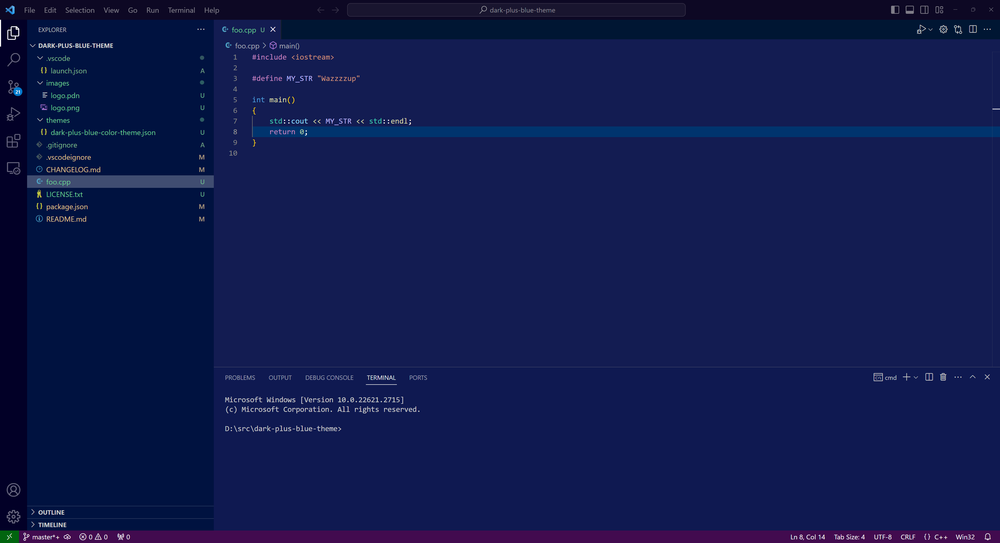

# Dark+ Blue Theme

This is a derivative of the "Tomorrow Night Blue" color theme, except it uses the Visual Studio semantic coloring of Dark+.

I made this color theme because I like the editor color scheme of Tomorrow Night Blue, but I also like the semantic text coloring of Visual Studio. So why not combine them?

The only other change is making C/C++ macros pink. For some reason, Dark+ makes them blue, which I do not like...

## LICENSE

"Dark+ Blue Theme" is copyrighted by Daniel Fuerlinger and licensed under the [MIT LICENSE](LICENSE.txt#L1).

This theme is based on the "Tomorrow Night Blue" and "Dark+" color themes in the [vscode-themes repo](https://github.com/microsoft/vscode-themes), which are copyrighted by Microsoft and licensed under the [MIT LICENSE](LICENSE.txt#L25).
